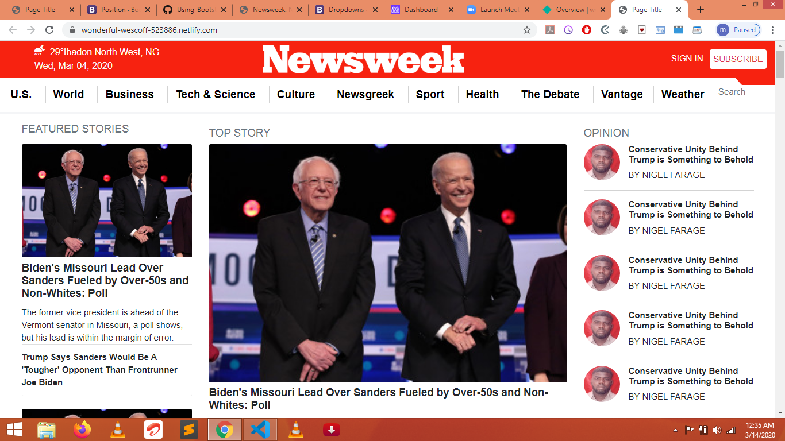

# bootstrap-project

> This is a pure bootstraps project and it is responsive but it also involues little css and media queries. The project is divided into three section header main and footer. the project has toggle button which appears when the webpage is brought to the minimum size.  

 

## Built With
- HTML and CSS
- Bootstrap
- Media Query

## Live Demo

[Live Demo Link](https://wonderful-wescoff-523886.netlify.com)

## Authors

👤 **Author1**

- Github: [@githubhandle](https://github.com/chinweokwu)
- Twitter: [@twitterhandle](https://twitter.com/Morah89820846)
- Linkedin: [linkedin](https://www.linkedin.com/in/paul-morah-285b63172/)

## 🤝 Contributing

Contributions, issues and feature requests are welcome!

Feel free to check the [issues page](https://github.com/chinweokwu/bootstrap-project/issues).

## Show your support

Give a ⭐️ if you like this project!

## Acknowledgments

- Hat tip to anyone whose code was used
- Inspiration
- etc

## 📝 License

This project is [MIT](lic.url) licensed.

FREE SOFTWARE ROCKS!
